📍 India | 🎓 CS Undergrad @ VIT | 🛡️ Building GraphGuard | ☁️ OCI GenAI Certified


## ⚡ About Me

```python
class Samrender:
    university = "Vellore Institute of Technology (VIT)"
    year       = "3rd Year · Computer Science"
    focus      = ["Generative AI", "Graph Neural Networks", "Network Security"]
    languages  = ["Python (Advanced)", "C++", "Java", "SQL", "R", "MATLAB"]
    frameworks = ["PyTorch"]
    cloud      = ["Oracle Cloud (OCI)"]
    tools      = ["Linux", "Git", "SonarQube"]
    interests  = ["LLMs & RAG", "Anomaly Detection", "Intrusion Detection"]

    def now(self):
        return "Building GraphGuard – GNN-based network intrusion detection"
```

## 🛠️ Tech Stack

**Languages**<br>


**AI / ML**<br>


**Cloud & Tools**<br>


## 🚀 Things I have built

- 🛡️ **GraphGuard** *(in progress)* - Network intrusion detection using graph neural networks &nbsp;`Python` `PyTorch` `GNN`
- 📊 [Code-Quality](https://github.com/samrender-tech/Code-Quality) - Code quality dashboard powered by SonarQube &nbsp;`SonarQube`
<!-- Add more: - 🔧 [Name](link) - One-line description `Tech` `Tech` -->

## 📈 GitHub Stats


## 🤝 Connect With Me

[](https://www.linkedin.com/in/samrender-singh)
[](mailto:samrender15@gmail.com)
[](https://github.com/samrender-tech)


